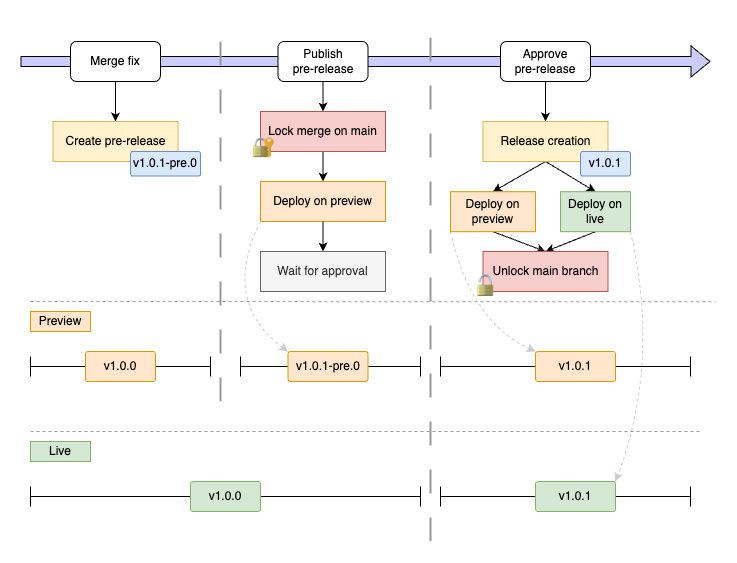

# Releases Playground

This repository exists to play with Github Releases & Pre-releases to check its behavior.

Moreover it attends to also check how CircleCI behave facing releases & pre-releases (even github actions).

## Case 1: Fix

How release process works when dealing when a fix Pull Request.

## Case 2: Feature

How release process works when dealing when a feature Pull Request.

## Case 3: Fix then feature

How release process works when dealing when a fix Pull Request and another feature Pull Request got merged.

## Case 4: QA Failure

How release process works when the QA Session reveal a failure, which forbid us to deploy this version.

## Known caveats

### Release content from previous pre-releases

When a pre-release is created (or even more than one) we want that the following "stable" release note (ie: not a pre-release) to contains all the change done in the pre-releases.

Unfortunately Release Drafter does not handle that.

To achieve this goal we have to delete all previous pre-release prior to asking to Release Drafter to generate the "stable" release.

This is achieve with the `.circleci/scripts/createFinalRelease.mjs` script.

### Unsychronized pre-release and stable release versions

When a pre-release is published (ex: `v1.0.1-pre.0`) any incoming merge done prior generating the stable release will increment the pre-release number (`v1.0.1-pre.1`, `v1.0.1-pre.2`), no matter the merge concern a fix or a feature.

BUT... since the CI process triggered when pre-release is approved delete all pre-release to trigger Release Drafter to create stable release ... the real "stable" release will follow semver rules :
- Previous = `v1.0.0`
- First pre-release (only fix) = `v1.0.1-pre.0`
- Second pre-release (with a feature) -> `v1.0.1-pre.1`
- Final release created = `v1.1.0` (`v1.0.1-pre.0` and `v1.0.1-pre.1` were removed, since changes are fix and feat the MINOR is bumped)

It may be confusing since QA was testing for a `v1.0.1-pre.1` version before the final release was generated.

It may be acceptable since it happen on rare case: only when a race condition occurs (#communicationTeam)

### Discarded pre-release content

When the final release is created through ReleaseDrafter there is a process which clean the previous pre-release.

Thus if you made some modification in the body/content of the release: it will be lost.

If the generated body of the final release does not suite your needs: you have to update it even if it was already releases.

Idea: Should we create the final release in "Draft" mode (but this required an additionnal click...)

### Ghost lock

Since the process put a lock on `main` branch when release process began, it may remains as a "ghost lock" if preview is not approved, and thus CircleCI workflow is cancelled.

Admin developer have to manually edit the "Branch protection rules" related to `main` to manually uncheck the "lock" state of the branch.

Note: To make the magic happen regarding the lock/unlock the token used by CircleCI must be related to a user (or bot user) with admin privilege on repository, maintainer is not enough.
